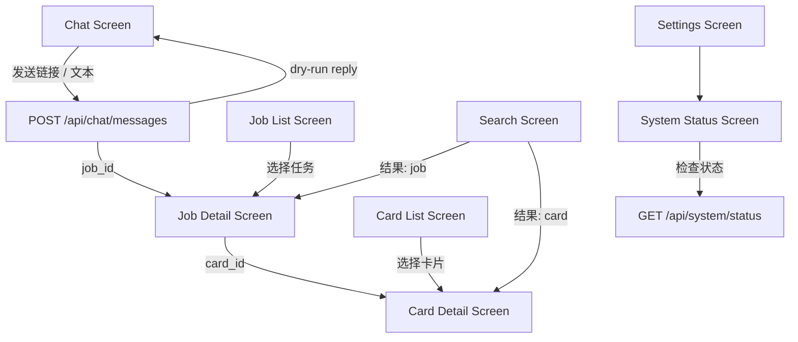

# App Interaction Map

本文件面向 Pixso 和未来 mobile-first Web UI 设计。目标是先把页面、状态、字段、接口和写入风险对齐，而不是现在实现手机 App。

## Product Boundary

- 第一阶段先做 mobile-first Web UI，不急着做原生手机 App。
- `Minimal Chat UI` 是测试页，不是正式 UI。
- 正式 Web UI 建议放在 `apps/web`。
- 未来原生手机 App 建议放在 `apps/mobile`。
- 后端服务后续可迁到 `apps/backend`。
- Pixso 导出、标注和设计说明建议放在 `design/pixso`。
- 前端只能调用 API，不能直接调用 `run_link_job.py`、不能直接写 SiYuan、不能读取或保存 `SIYUAN_TOKEN`、不能读取或保存模型 API Key。

## Navigation

底部导航建议包含五个主入口：

- 聊天：Chat Screen
- 任务：Job List Screen
- 卡片：Card List Screen
- 搜索：Search Screen
- 设置：Settings Screen

System Status Screen 可以从 Settings Screen 进入，也可以在系统异常时以 banner / sheet 方式出现。

## Page Map



## 1. Chat Screen / 聊天输入页

### 页面目标

作为手机端主入口，接收链接、普通文本、抖音分享文本、未来文件或截图入口，并返回后端回执。

### 用户能做什么

- 输入或粘贴链接 / 文本。
- 打开或关闭 dry-run。
- 发送消息。
- 查看后端 `reply_text`。
- 点击返回的 `job_id` 进入 Job Detail。
- 从系统分享入口进入时，预填分享 URL / 文本。

### 需要展示哪些字段

- 输入框：`text`
- dry-run 开关：默认开启，尤其是设计和调试期。
- 发送状态：待发送、发送中、成功、失败。
- 回执字段：`ok`、`reply_text`、`status`、`handled_by`、`job_id`、`error`
- 配置提醒：`data.config_warnings[]`、`data.config_preflight.status`
- 调试折叠区：`data.url`、`data.extra_url_count`、`data.result.failure_stage`、`used_mcp`

### 调用哪些接口

- 已实现：`POST /api/chat/messages`
- 已实现：`GET /api/system/status`
- 可选启动检查：`GET /health`
- 未来分享入口：`POST /api/share/receive`
- 未来文件入口：`POST /api/intake/file`

### 空状态

- 输入为空时禁用发送按钮。
- 对话区可显示最近一次提示：可以发送链接、抖音分享或普通文本。

### 加载状态

- 发送按钮进入 loading。
- 输入框保持内容但禁用重复发送。
- 如果 `dry_run=false`，应显示“真实处理可能较慢”的轻量提示。

### 成功状态

- 展示 `reply_text`。
- 如果 `data.config_warnings` 非空，必须在回复前或回复气泡顶部展示配置提醒，例如模型 API Key、SiYuan Token 或 Lucas Database API Key 未配置；不要让用户等任务失败后猜原因。
- 如果返回 `job_id`，出现“查看任务”动作。
- 如果 `status=dry_run`，明确展示“未调用 runner / 未写入”。

### 失败状态

- 展示 `error` 或 `reply_text` 中的失败摘要。
- 如果失败同时带有 `data.config_warnings`，优先展示配置提醒，并引导到模型配置或存储配置。
- 如果有 `job_id`，仍然允许进入 Job Detail，因为失败也可能保留本地 job。
- 网络失败时提供重试发送。

### 是否需要 dry-run 开关

需要。默认开启。用户明确要真实入库时才关闭。

### 是否会触发真实写入

- `dry_run=true`：不会触发真实写入，不调用 `run_link_job.py`。
- `dry_run=false` 且文本包含链接：可能触发 `run_link_job.py`、模型写卡、质量门禁和 SiYuan 写入。
- 普通聊天和 command 不触发真实写入。

### Pixso 设计注意事项

- 手机优先，输入区固定在底部，避免遮挡系统键盘。
- dry-run 是一个清楚的开关，不要藏在二级菜单。
- 发送按钮用图标或短文本，状态变化要明显。
- `reply_text` 可能多行，设计成可展开消息气泡或结果面板。
- 多 URL 提示要可见，因为当前 V1 只处理第一个链接。

## 2. Job List Screen / 任务列表页

### 页面目标

让用户快速查看所有处理任务的最新状态，区分 processing、completed、failed、needs_review。

### 用户能做什么

- 查看最近任务。
- 按状态筛选：全部、处理中、已完成、失败、待复核。
- 下拉刷新。
- 点击任务进入详情。
- 未来可触发重试，但第一版可只读。

### 需要展示哪些字段

- `job_id`
- `title`
- `source_url` 或来源域名
- `source_type`
- `status`
- `phase`
- `content_level`
- `card_type`
- `created_at`
- `updated_at`
- `has_card`
- `write_ok`
- `error`

### 调用哪些接口

- 近期必须实现：`GET /api/jobs`
- 点击后：`GET /api/jobs/{job_id}`

### 空状态

- 没有任务时显示“还没有处理任务”。
- 可以提供“去聊天页发送一个链接”的动作。

### 加载状态

- 首屏骨架列表。
- 下拉刷新时顶部小 loading，不清空已有列表。

### 成功状态

- 列表按 `updated_at` 倒序。
- 每个任务显示状态标签和最后阶段。
- `failed` 或 `needs_review` 使用醒目但克制的状态色。

### 失败状态

- API 失败时保留旧列表，顶部显示错误提示。
- 如果无旧数据，显示错误空状态和重试按钮。

### 是否需要 dry-run 开关

不需要。列表页只读。

### 是否会触发真实写入

不会。只读接口不得写 SiYuan、不得调用模型、不得调用 `run_link_job.py`。

### Pixso 设计注意事项

- 列表项应适合单手快速扫读：标题、状态、时间、来源四个优先级最高。
- `phase` 用小号文本或状态进度，不要让技术状态压过标题。
- 不要显示本地绝对路径 `job_dir`。
- 支持长标题换行最多两行，避免挤压状态标签。

## 3. Job Detail Screen / 任务详情页

### 页面目标

展示一个 job 从接收到读取、转写、OCR、评论、写卡、质量门禁、写入的完整状态。

### 用户能做什么

- 查看任务时间线。
- 查看来源信息。
- 查看 transcript / OCR / comments 的短摘录和边界。
- 查看 composer 和 quality gate 结果。
- 点击关联知识卡。
- 未来可重试任务。

### 需要展示哪些字段

- `job.job_id`
- `job.source_url`
- `job.source_type`
- `job.title`
- `job.status`
- `job.phase`
- `job.card_type`
- `job.content_level`
- `job.created_at`
- `job.updated_at`
- `materials.content.status/title/author/final_url`
- `materials.transcript.status/has_speech/confidence/excerpt`
- `materials.ocr.status/frame_count/excerpt`
- `materials.comments.status/comment_count/comments_hash`
- `composer.composer_status/model_provider/model_used`
- `quality_gate.quality_gate_passed/failed_checks`
- `storage.siyuan_write_ok/write_path/doc_id/error`
- `card_id`

### 调用哪些接口

- 近期必须实现 / 当前部分实现：`GET /api/jobs/{job_id}`
- 未来重试：`POST /api/jobs/{job_id}/retry`
- 查看卡片：`GET /api/cards/{card_id}`

### 空状态

- `job_id` 无效或不存在时显示“任务不存在或已被清理”。
- 没有卡片时显示“尚未生成知识卡”或“处理失败，只有 job 记录”。

### 加载状态

- 顶部任务摘要骨架。
- 时间线用 skeleton row。
- 如果 job 仍在 processing，允许定时刷新或手动刷新；后续可接 SSE / WebSocket。

### 成功状态

- 用时间线展示阶段：接收、页面读取、转写、OCR、评论、写卡、质量门禁、写入。
- 对 `temporary_review_card` 和 `temporary_card` 明确标注不是正式知识卡。
- 对 Level 4/5 明确展示边界：OCR 和评论是条件增强，不保证每条都可达。

### 失败状态

- 展示失败阶段和错误摘要。
- 如果本地 job 保留，展示“已保留记录”。
- 如果写入失败但卡片已生成，展示“本地卡已保留，SiYuan 未写入”。

### 是否需要 dry-run 开关

详情页本身不需要。未来重试动作需要 dry-run 开关，且默认开启。

### 是否会触发真实写入

- 查看详情不会。
- 未来 `retry` 若 `dry_run=false`，可能触发真实处理和写入。

### Pixso 设计注意事项

- 首屏优先显示任务状态、标题、来源和主动作。
- 时间线适合做纵向单列，不要做宽表。
- 失败详情默认折叠，避免压垮页面。
- transcript 只显示短摘录，不要设计成默认大段全文阅读。

## 4. Card List Screen / 知识卡列表页

### 页面目标

展示已经生成的正式卡、临时复核卡、临时卡和失败卡，支持快速进入阅读与复核。

### 用户能做什么

- 浏览知识卡列表。
- 按 `card_type`、`content_level`、`quality_level`、标签筛选。
- 点击进入 Card Detail。
- 查看是否已同步 SiYuan / 数据库。

### 需要展示哪些字段

- `card_id`
- `job_id`
- `title`
- `card_type`
- `content_level`
- `quality_level`
- `source_url`
- `tags`
- `created_at`
- `updated_at`
- `storage_status`

### 调用哪些接口

- 近期必须实现：`GET /api/cards`
- 点击后：`GET /api/cards/{card_id}`

### 空状态

- 没有知识卡时显示“还没有生成知识卡”。
- 提供“去聊天页发送链接”的动作。

### 加载状态

- 卡片列表骨架。
- 筛选切换时使用局部 loading。

### 成功状态

- 正式卡与临时卡用清楚标签区分。
- `quality_level=low` 的卡不要视觉上伪装成正式高质量卡。

### 失败状态

- API 失败时显示错误和重试。
- 如本地索引未建成，说明“卡片列表接口暂未可用”。

### 是否需要 dry-run 开关

不需要。列表页只读。

### 是否会触发真实写入

不会。只读接口不得写 SiYuan、不得调用模型、不得调用 `run_link_job.py`。

### Pixso 设计注意事项

- 卡片列表比任务列表更偏阅读：标题、摘要、标签优先。
- `card_type` 标签必须醒目，尤其是 `temporary_review_card`。
- 长标签应横向滚动或换行，不能撑破卡片。
- 不要把每个列表项设计得过厚，手机端要能快速扫。

## 5. Card Detail Screen / 知识卡详情页

### 页面目标

让用户阅读、复核和未来编辑单张知识卡。

### 用户能做什么

- 阅读 `ComposedCardV1` 内容。
- 查看来源和关联 job。
- 查看质量门禁结果。
- 查看写入状态。
- 未来可编辑部分字段。
- 未来可手动同步 SiYuan。

### 需要展示哪些字段

- `display_title`
- `one_sentence_summary`
- `original_summary`
- `core_points`
- `knowledge_blocks`
- `methodology`
- `application_suggestions`
- `follow_up_actions`
- `comment_signals`
- `reusable_value`
- `risks`
- `tags`
- `evidence_quotes`
- `appendix_transcript_excerpt`
- `card_type`
- `content_level`
- `quality_level`
- `composer_status`
- `model_provider`
- `model_used`
- `quality_gate.quality_gate_passed`
- `storage.siyuan_write_ok`
- `storage.write_path`

### 调用哪些接口

- 近期必须实现：`GET /api/cards/{card_id}`
- 未来编辑：`PATCH /api/cards/{card_id}`
- 未来同步：`POST /api/cards/{card_id}/sync-siyuan`
- 查看来源任务：`GET /api/jobs/{job_id}`

### 空状态

- 卡片不存在时显示“知识卡不存在或索引尚未生成”。
- 如果只有 job 没有卡，提供返回 Job Detail。

### 加载状态

- 标题、摘要、内容区骨架。
- Markdown 渲染可后加载。

### 成功状态

- 正式卡：突出摘要、核心观点和知识块。
- 临时复核卡：顶部显示低置信度 / 需复核提示。
- 失败卡：顶部显示不是正式摘要。

### 失败状态

- API 失败时展示错误和重试。
- Markdown 渲染失败时仍展示结构化字段。

### 是否需要 dry-run 开关

阅读不需要。未来“同步 SiYuan”动作需要 dry-run 开关或确认流程，默认 dry-run。

### 是否会触发真实写入

- 阅读不会。
- `PATCH` 默认只更新卡片索引，不写 SiYuan。
- `sync-siyuan` 若 `dry_run=false` 会触发 SiYuan 写入，但只能由后端使用 token。

### Pixso 设计注意事项

- 手机阅读优先：标题、摘要和核心观点不要塞进小卡片套小卡片。
- 章节可折叠：知识块、评论信号、风险、证据片段。
- `temporary_review_card` 和 `failure_card` 要明显不同于正式卡。
- “同步 SiYuan”属于高风险动作，应放在明确区域，不要误触。

## 6. Search Screen / 搜索页

### 页面目标

统一搜索任务、卡片、来源、标签和摘要。

### 用户能做什么

- 输入关键词。
- 查看搜索建议或最近搜索。
- 点击结果进入 Job Detail 或 Card Detail。
- 按类型过滤：全部、任务、卡片、来源。

### 需要展示哪些字段

- `query`
- `items[].type`
- `items[].id`
- `items[].title`
- `items[].snippet`
- `items[].score`
- `items[].target_screen`

### 调用哪些接口

- 未来预留：`GET /api/search?q=...`
- 点击结果后调用：`GET /api/jobs/{job_id}` 或 `GET /api/cards/{card_id}`

### 空状态

- 未输入时展示最近任务 / 最近卡片入口。
- 无结果时展示“没有找到匹配内容”。

### 加载状态

- 搜索输入 debounce 后展示小 loading。
- 不要每个字符都立即请求。

### 成功状态

- 结果按相关度或更新时间排序。
- 每条结果显示类型标签。

### 失败状态

- 搜索接口不可用时提示“搜索暂未可用”，但保留底部导航。

### 是否需要 dry-run 开关

不需要。搜索只读。

### 是否会触发真实写入

不会。

### Pixso 设计注意事项

- 搜索页首屏保持简单：搜索框、筛选 chips、结果列表。
- 高亮命中片段时避免过度彩色。
- 搜索结果类型标签应清楚区分任务和卡片。

## 7. Settings Screen / 设置页

### 页面目标

展示前端可见的配置状态，提供进入系统状态、AI Provider、Storage Provider 设置的入口。

### 用户能做什么

- 查看 API Base URL。
- 查看当前 AI Provider 是否配置。
- 查看当前 Storage Provider 是否配置。
- 进入 System Status。
- 未来通过后端配置 AI / Storage Provider。
- 清理本地 UI 偏好，如默认 dry-run。

### 需要展示哪些字段

- API：base URL、health 状态
- AI：`provider_id`、`label`、`model`、`api_key_present`、`supports_vision`、`supports_json_mode`
- Storage：`provider_id`、`label`、`api_key_present`、`status`
- 配置提醒：`config_warnings[].title/message/action`
- UI 偏好：默认 dry-run、主题、调试信息开关

### 调用哪些接口

- 已实现：`GET /health`
- 已实现：`GET /api/system/status`
- 现有测试 UI 已有但本轮非重点：`GET /api/ai/providers`、`GET /api/ai/config`、`POST /api/ai/config`、`GET /api/storage/providers`、`GET /api/storage/config`、`POST /api/storage/config`

### 空状态

- 未连接后端时显示 API 不可达。
- 未配置 Provider 时显示“未配置密钥”，但不展示密钥输入值。

### 加载状态

- 状态卡片 skeleton。
- Provider 配置读取时单独 loading。

### 成功状态

- 展示“已配置 / 未配置 / 未检查 / 异常”。
- 如果 `config_warnings` 非空，展示明确可执行的提醒和入口，例如“去模型配置保存 API Key”“去存储配置保存 Lucas Database API Key”。
- 对 key 只显示 `api_key_present`，最多显示后端返回的安全 last4，不显示完整 key。

### 失败状态

- API 不可达时，设置页仍可打开并展示本地 UI 偏好。
- 配置保存失败时展示后端错误，不记录密钥到日志。

### 是否需要 dry-run 开关

需要作为全局默认偏好。这个开关影响 Chat Screen 默认值，不直接触发任务。

### 是否会触发真实写入

- 查看设置不会。
- 保存 Provider 配置会写本地后端配置文件或 `.env`，但不写 SiYuan、不调用模型、不调用 `run_link_job.py`。
- 测试模型连接可能调用模型 API，但不写卡、不写 SiYuan。

### Pixso 设计注意事项

- 设置页不要设计成密钥管理器；前端不保存底层 token。
- 对敏感字段使用“已配置 / 未配置”的状态表达。
- 高风险配置动作放在二级页面，避免误触。

## 8. System Status Screen / 系统状态页

### 页面目标

集中展示后端运行状态和能力边界，帮助用户判断为什么任务不能处理或不能写入。

### 用户能做什么

- 查看 API 是否在线。
- 查看 runtime jobs 目录是否可读。
- 查看 runner 是否可用。
- 查看 AI Provider 是否配置。
- 查看 Storage / SiYuan readiness。
- 查看当前能力边界和实验能力。
- 手动刷新。

### 需要展示哪些字段

- `status`
- `service`
- `api.version`
- `api.health_ok`
- `runtime.jobs_dir_configured`
- `runtime.jobs_dir_readable`
- `runtime.runner_available`
- `ai.provider_id`
- `ai.label`
- `ai.configured`
- `ai.api_key_present`
- `ai.status`
- `storage.active_provider`
- `storage.storage_targets`
- `storage.targets[].provider_id`
- `storage.targets[].label`
- `storage.configured`
- `storage.targets[].api_key_present`
- `storage.status`
- `config_warnings[].code/title/message/action`
- `capabilities.chat_gateway`
- `capabilities.link_intake`
- `capabilities.douyin_level3_transcript`
- `capabilities.conditional_ocr`
- `capabilities.comments_enhancement`
- `capabilities.formal_card_requires_composer_and_quality_gate`
- `used_mcp`

### 调用哪些接口

- 已实现：`GET /api/system/status`
- fallback：`GET /health`

### 空状态

- 后端不可达时显示“无法连接后端”，并展示当前配置的 API base URL。

### 加载状态

- 状态检查中显示逐项 skeleton 或 spinner。
- 刷新时保留旧结果并标注更新时间。

### 成功状态

- `ok`：主能力可用。
- `degraded`：API 在线但模型、Storage、SiYuan 或 runner 有缺项。
- `failed`：核心 API 或 runtime 不可用。
- `config_warnings` 非空时，必须展示具体缺项，不能只显示笼统的 degraded。

### 失败状态

- 网络失败时只展示本地错误，不猜测 token 状态。
- 对 SiYuan / AI 的失败只展示后端返回的安全摘要。

### 是否需要 dry-run 开关

不需要。状态检查只读。

### 是否会触发真实写入

不会。状态检查不得写 SiYuan、不得调用 `run_link_job.py`、默认不得调用模型。

### Pixso 设计注意事项

- 用分组状态卡：API、Runtime、AI、Storage、Capabilities。
- 能力边界要短句展示：Level 4 OCR 条件触发，Level 5 评论机会型增强。
- `used_mcp=false` 可放在调试信息区，不必占主视觉。
- 不展示真实 token、API key 或完整环境变量值。

## Cross-Screen States

### Status Language

- `queued`：已接受，等待处理。
- `processing`：处理中。
- `completed`：处理完成。
- `failed`：处理失败。
- `needs_review`：需要模型或人工复核。
- `low_confidence`：低置信度临时结果。

### Card Type Language

- `formal_summary`：正式知识卡。
- `temporary_review_card`：临时复核卡，不是正式知识卡。
- `temporary_card`：临时卡，内容不足或低置信度。
- `failure_card`：失败记录卡，不是摘要。

### Content Level Language

- Level 1：手动文本 / 临时暂存。
- Level 2：页面可见内容级。
- Level 3：视频口播转写级。
- Level 4：画面 OCR 增强级，条件触发。
- Level 5：评论与互动增强级，机会型增强。

## Mock Data

以下 mock 与 `docs/API_CONTRACT_V1.md` 保持一致，便于前端先用假数据画页面和做静态原型。

### 成功 HandlerResponse

```json
{
  "ok": true,
  "reply_text": "已检测到链接：https://v.douyin.com/example/\nDry-run：未调用 run_link_job.py，未写入 SiYuan。",
  "job_id": null,
  "status": "dry_run",
  "handled_by": "link_handler",
  "error": null,
  "data": {
    "message_id": "msg_mock_success",
    "url": "https://v.douyin.com/example/",
    "runner_called": false,
    "write_skipped": true,
    "config_warnings": [],
    "config_preflight": {"ok": true, "status": "ready", "warnings": [], "used_mcp": false},
    "used_mcp": false
  }
}
```

### 失败 HandlerResponse

```json
{
  "ok": false,
  "reply_text": "处理失败或写入未完成，但已保留本地 job。",
  "job_id": "20260630-153000-failed01",
  "status": "failed_but_recorded",
  "handled_by": "link_handler",
  "error": "whisper 转写失败",
  "data": {
    "message_id": "msg_mock_failed",
    "url": "https://v.douyin.com/example-failed/",
    "result": {
      "failure_stage": "transcribe_failed",
      "write_ok": false,
      "used_mcp": false
    },
    "config_warnings": [],
    "config_preflight": {"ok": true, "status": "ready", "warnings": [], "used_mcp": false},
    "used_mcp": false
  }
}
```

### processing JobDetail

```json
{
  "ok": true,
  "job": {
    "job_id": "20260630-153000-processing01",
    "source_url": "https://v.douyin.com/processing/",
    "source_type": "video/douyin",
    "title": "处理中任务",
    "status": "processing",
    "phase": "transcribing",
    "card_type": null,
    "content_level": null,
    "created_at": "2026-06-30T15:30:00+08:00",
    "updated_at": "2026-06-30T15:31:30+08:00",
    "used_mcp": false
  },
  "materials": {
    "content": {"status": "page_fetched", "title": "处理中任务"},
    "transcript": {"status": "transcribing", "has_speech": null, "excerpt": ""},
    "ocr": {"status": "not_started", "frame_count": 0, "excerpt": ""},
    "comments": {"status": "not_started", "comment_count": 0, "comments_hash": ""}
  },
  "composer": {"composer_status": "not_started"},
  "quality_gate": {"quality_gate_passed": null, "failed_checks": []},
  "storage": {"siyuan_write_ok": false, "write_path": ""},
  "card_id": null,
  "used_mcp": false
}
```

### completed JobDetail

```json
{
  "ok": true,
  "job": {
    "job_id": "20260630-153000-completed01",
    "source_url": "https://v.douyin.com/completed/",
    "source_type": "video/douyin",
    "title": "AI 工作流复盘",
    "status": "completed",
    "phase": "completed_formal",
    "card_type": "formal_summary",
    "content_level": "Level 5 评论与互动增强级",
    "created_at": "2026-06-30T15:30:00+08:00",
    "updated_at": "2026-06-30T15:36:00+08:00",
    "used_mcp": false
  },
  "materials": {
    "content": {"status": "ok", "title": "AI 工作流复盘"},
    "transcript": {"status": "transcribed", "has_speech": true, "excerpt": "这个视频讲的是把内容处理流程拆成可复用步骤。"},
    "ocr": {"status": "skipped_not_needed", "frame_count": 0, "excerpt": ""},
    "comments": {"status": "comments_done", "comment_count": 8, "comments_hash": "sha256:completed-mock"}
  },
  "composer": {"composer_status": "success", "model_provider": "deepseek_compatible", "model_used": "deepseek-chat"},
  "quality_gate": {"quality_gate_passed": true, "failed_checks": []},
  "storage": {"siyuan_write_ok": true, "write_path": "/知识卡/AI/AI 工作流复盘"},
  "card_id": "card_20260630_153000_completed01",
  "used_mcp": false
}
```

### failed JobDetail

```json
{
  "ok": true,
  "job": {
    "job_id": "20260630-153000-failed01",
    "source_url": "https://v.douyin.com/failed/",
    "source_type": "video/douyin",
    "title": "处理失败任务",
    "status": "failed",
    "phase": "failed_but_recorded",
    "card_type": "failure_card",
    "content_level": "none",
    "created_at": "2026-06-30T15:30:00+08:00",
    "updated_at": "2026-06-30T15:34:00+08:00",
    "used_mcp": false
  },
  "materials": {
    "content": {"status": "page_fetch_failed", "title": ""},
    "transcript": {"status": "transcribe_failed", "has_speech": false, "excerpt": ""},
    "ocr": {"status": "not_run", "frame_count": 0, "excerpt": ""},
    "comments": {"status": "comments_skipped", "comment_count": 0, "comments_hash": ""}
  },
  "composer": {"composer_status": "not_run"},
  "quality_gate": {"quality_gate_passed": false, "failed_checks": ["composer_not_run"]},
  "storage": {"siyuan_write_ok": false, "write_path": "", "error": "SiYuan not started"},
  "card_id": null,
  "error": "页面读取或转写失败，已保留本地 job 记录。",
  "used_mcp": false
}
```

### CardDetail

```json
{
  "ok": true,
  "card": {
    "card_id": "card_20260630_153000_completed01",
    "job_id": "20260630-153000-completed01",
    "schema_name": "ComposedCardV1",
    "schema_version": "1",
    "card_type": "formal_summary",
    "content_level": "Level 5 评论与互动增强级",
    "quality_level": "high",
    "display_title": "AI 工作流复盘",
    "one_sentence_summary": "把自动化内容处理拆成可检查、可复盘、可复用的 job 流程。",
    "core_points": ["入口层只负责接收消息和路由。", "正式知识卡必须经过模型写卡和质量门禁。", "失败结果应保留为临时复核或失败记录。"],
    "knowledge_blocks": [
      {
        "concept": "入口与处理分离",
        "explanation": "Chat Gateway 不直接承担转写、OCR、写卡或存储职责。",
        "evidence": "入口层只负责接收消息和路由。",
        "reusable_value": "前端只要对齐 API，就可以替换入口形态而不改变主链路。"
      }
    ],
    "application_suggestions": ["移动端先围绕任务状态和卡片复核做设计。"],
    "follow_up_actions": ["实现 `/api/jobs` 和 `/api/cards` 后接入真实列表。"],
    "risks": ["OCR 和评论增强不是每条内容都稳定可达。"],
    "tags": ["AI", "个人知识库", "移动端"],
    "composer_status": "success",
    "model_provider": "deepseek_compatible",
    "model_used": "deepseek-chat"
  },
  "quality_gate": {"quality_gate_passed": true, "failed_checks": []},
  "storage": {"siyuan_write_ok": true, "write_path": "/知识卡/AI/AI 工作流复盘"},
  "used_mcp": false
}
```

### SystemStatus

```json
{
  "ok": false,
  "status": "degraded",
  "service": "chat_gateway",
  "api": {"version": "0.1.0", "health_ok": true, "base_url": "http://127.0.0.1:3963"},
  "runtime": {"jobs_dir_configured": true, "jobs_dir_readable": true, "runner_available": true},
  "ai": {
    "provider_id": "deepseek_compatible",
    "label": "DeepSeek",
    "kind": "ai",
    "protocol": "openai_compatible",
    "configured": false,
    "api_key_present": false,
    "api_key_env": "DEEPSEEK_API_KEY",
    "base_url_label": "https://api.deepseek.com",
    "model": "deepseek-chat",
    "status": "not_configured",
    "supports_vision": false,
    "supports_json_mode": true,
    "error": ""
  },
  "storage": {
    "active_provider": "lucas_database",
    "storage_targets": ["siyuan", "lucas_database"],
    "auto_ingest_enabled": true,
    "configured": false,
    "status": "not_configured",
    "targets": [
      {"provider_id": "siyuan", "label": "SiYuan", "configured": false, "api_key_present": false, "api_key_env": "SIYUAN_TOKEN", "status": "not_configured"},
      {"provider_id": "lucas_database", "label": "Lucas Database / Brain", "configured": false, "api_key_present": false, "api_key_env": "LUCAS_DB_API_KEY", "status": "not_configured"}
    ]
  },
  "config_warnings": [
    {
      "code": "ai_api_key_missing",
      "severity": "warning",
      "target": "ai",
      "title": "模型 API Key 未配置",
      "message": "当前模型提供方是 DeepSeek，但没有检测到 API Key。普通聊天和正式知识卡写作会失败。",
      "action": "在设置里的模型配置保存 API Key，或配置环境变量 DEEPSEEK_API_KEY。"
    }
  ],
  "capabilities": {
    "chat_gateway": true,
    "link_intake": true,
    "douyin_level3_transcript": true,
    "conditional_ocr": true,
    "comments_enhancement": "opportunistic",
    "formal_card_requires_composer_and_quality_gate": true,
    "mcp_required_for_production": false
  },
  "used_mcp": false
}
```

## Pixso Design Notes / Pixso 设计注意事项

- 先做 mobile-first Web UI，不急着做原生手机 App。
- 页面宽度优先按手机屏幕设计，再考虑桌面响应式。
- 底部导航建议包含：聊天、任务、卡片、搜索、设置。
- Minimal Chat UI 只是测试页，不是正式 UI。
- 正式 UI 应放在 `apps/web`。
- 未来原生手机 App 放在 `apps/mobile`。
- 后端在 `apps/backend`。
- Pixso 导出和设计说明放在 `design/pixso`。
- 设计中不要出现 `SIYUAN_TOKEN`、DeepSeek API Key 或其他密钥字段的明文输入回显。
- 真实写入相关动作必须有清楚状态：dry-run、将写入、已写入、写入失败。
- 临时卡和失败卡不能在视觉上伪装成正式知识卡。
- Level 4 OCR 和 Level 5 评论增强要表达为条件能力，不要设计成每条内容必然成功的固定流程。

## Handoff For Design

Pixso 第一版建议优先画：

- Chat Screen：含 dry-run 开关、发送状态、回执卡片。
- Job List Screen：含筛选和状态标签。
- Job Detail Screen：含任务时间线和材料边界。
- Card List Screen：含正式卡 / 临时卡区分。
- Card Detail Screen：含 `ComposedCardV1` 阅读结构。
- Search Screen：先画静态搜索结果。
- Settings Screen：只展示安全配置状态。
- System Status Screen：展示 API / Runtime / AI / Storage / Capabilities。
